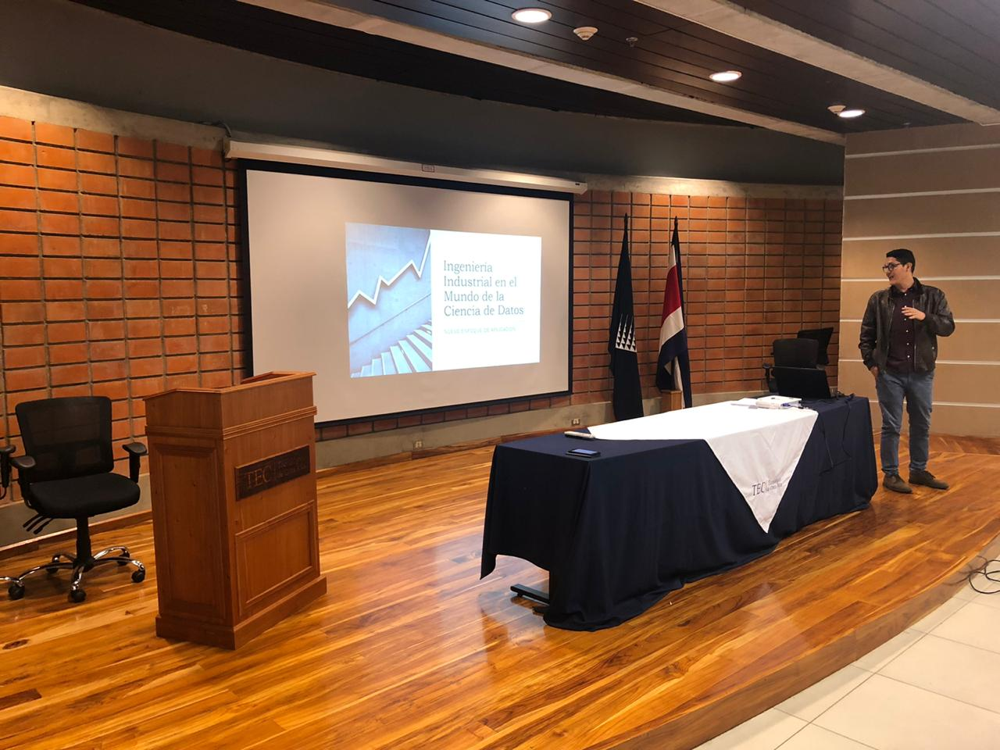
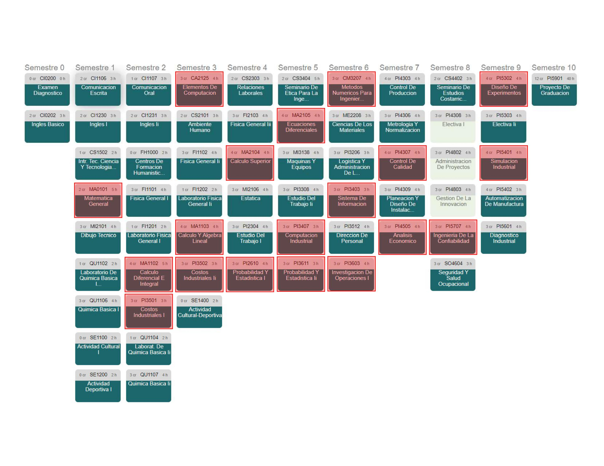
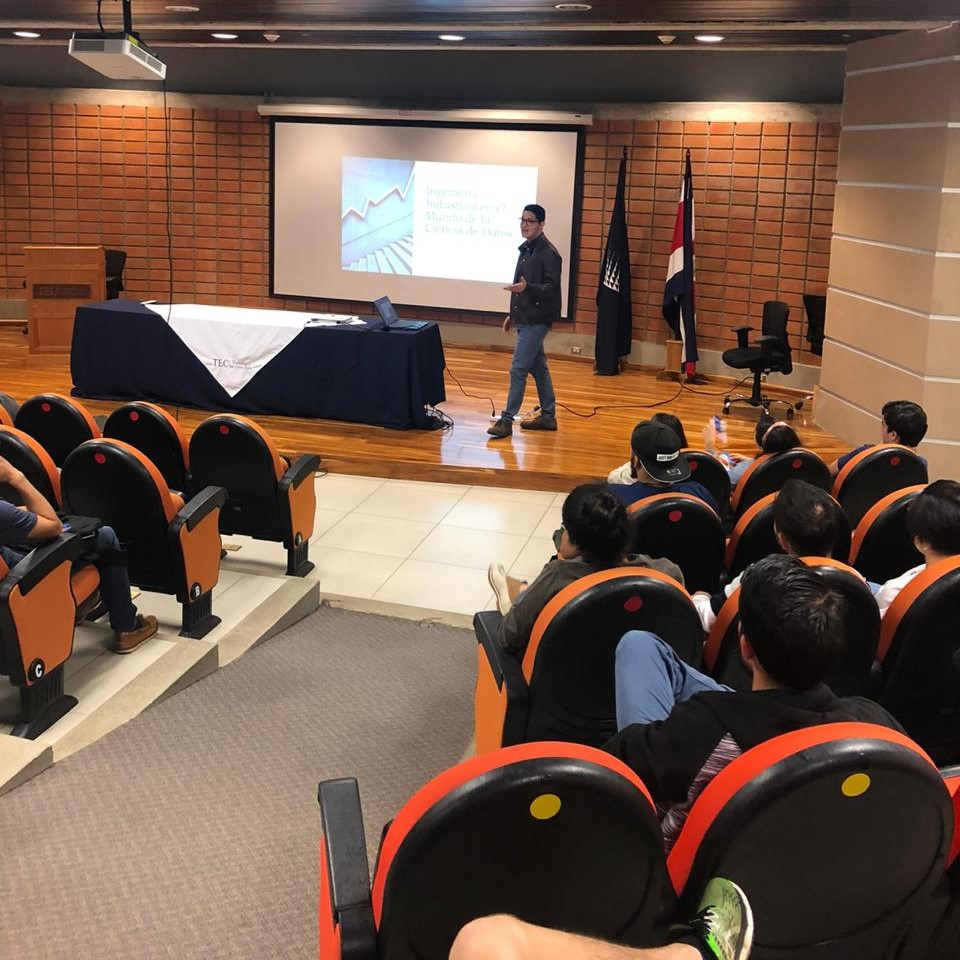

```{r setup, include=FALSE}
knitr::opts_chunk$set(eval = FALSE, collapse = TRUE, comment = NA, tidy = FALSE)
```

<div style="text-align: justify">

> Existe una profesión altamente demandada en el mundo de las empresas, no sólo por su aporte vital para la toma de decisiones, sino también porque es una de las disciplinas esenciales tras la 4ta Revolución Industrial. Muy bien pagada y la última tendencia en el quehacer científico, la tecnología y los negocios; tal es su relevancia que (según el expositor de la charla que se comentará a continuación) expertos de la más variada lista de disciplinas están cursando posgrados y hasta doctorados en esta materia. Estoy hablando, sin duda, de la Ciencia de datos... ¿o quizá de la Ingeniería Industrial?


De esto trató **la primera charla auspiciada por el grupo DABIA**, realizada en la sede del Tecnológico de Costa Rica en Cartago el pasado **miércoles 4 de marzo**, a estudiantes de la carrera de Producción Industrial. La charla se titulaba **"Ingeniería Industrial en un mundo de Ciencia de Datos"** y fue brindada por el **Ing. Oldemar Viales Hernández**, Decision Manager II en Walmart. 

## Dos caras de una misma moneda
*¿Qué es la Ingeniería Industrial y por qué decidieron estudiar esta carrera?* Preguntó el Ing. Viales a la audiencia mientras proyectaba una definición extraída de los [vídeos promocionales del TEC sobre la carrera](https://www.youtube.com/watch?v=Bjc3z1jUQuo&t=27s).



<div/>

<center>

> "Es el área de la ingeniería que planea, diseña, implementa y optimiza los sistemas de manufactura de bienes y servicios, (...) en procura de obtener la máxima productividad."

</center>

<div style="text-align: justify">

¿Pero, con base en qué se planea, diseña y optimiza? ¡En datos! *Un ingeniero sin datos no es un ingeniero*, afirma Viales. Efectivamente, somos ingenieros porque **tomamos decisiones con base en datos y no en la intuición**; como bien dijo el expositor: *¡En Dios confío, los demás denme datos!*

Actualmente la convergencia entre nuestros sistemas de manufactura, la tecnología y el mundo digital está generando un volumen ingente de datos. *Todo lo que nos rodea genera datos*. Entonces, ¿qué hacer para aprovechar todo este abanico de posibilidades sin morir en el intento? **_La Ciencia de datos_**, comenta Viales, *es la que se encarga de extraer información de grandes cantidades de datos, combinando **la estadística, la matemática y la informática** * ([Neoland, 2019](https://www.neoland.es/blog/que-es-data-science)). Acto seguido, el expositor proyectó a la audiencia la malla curricular de la carrera de Ingeniería en Producción Industrial, **marcando en rojo los cursos de estadística, matemática e informática**. El hecho es evidente. *¡Todos ustedes son Data Scientist, créanselo!*, afirmó.

<div/>

<center>



</center>

<div style="text-align: justify">

## La experiencia de Oldemar

El Ing. Viales afirma que Producción Industrial es una carrera con un atractivo inmenso en el mercado, por factores tales como:

* La versatilidad de su área de aplicación
* Su bagaje de conocimiento
* Su visión elementalmente holística
* Su conocimiento del negocio
* Su perspectiva ingenieril: "pensar fuera de la caja"

En palabras del expositor, *Produ es una carrera que te puede llevar **a las grandes ligas** *. Tal afirmación no extraña al conocer, por ejemplo, la trayectoria del Ing. Viales: 

* Boston Scientific
* Cargill
* Western Union
* Smith&Nephew
* Walmart

Actualmente Viales labora para Walmart, realizando ciencia de datos; pero, además, es **consultor e instructor de Analytics de la Camara de Industria de Costa Rica**. Más información de su currículum en su [cuenta de LinkedIn](https://www.linkedin.com/in/oldemar-viales-hernández-b2b805140)

## ¿Qué nos hace falta?

Lo imprescindible ya lo tenemos: una formación orientada a la toma de decisiones con base en datos, NO en la intuición. Según el Ing. Viales, lo que nos falta es poco, fácil pero **indispensable**:

* SQL
* R
* Python
* Tableau
* Power Bi
* Excel avanzado

[Parte de nuestra misión en DABIA](https://www.grupodabia.com/nosotros/) es **fomentar el desarrollo de conocimiento sobre la Ciencia de datos**; por tanto, tomamos nota de los consejos del Ing. Viales para desarrollar y difundir oportunidades donde aprender de estas herramientas, a nivel del Tecnológico y más allá si es posible.

Visto lo visto, siendo fuertes en las bases estadísticas-matemáticas y con un poco más de conocimientos en programación, los futuros ingenieros industriales saldrán al mercado con uno de los perfiles más relevantes actualmente. **Y usted, ¿le apuesta a la Ciencia de datos?** En palabras de uno de los cursos de [DataCamp](www.datacamp.com) (plataforma en línea para aprender Ciencia de datos):

<div/>

<center>

> " Feeling lucky? You better, because you're going to take a trip to the Statisticians Paradise. (...) Next stop, Vegas Baby... VEGAS!! "

</center>




## Addendum
¿Interesado en el tema de Ciencia de datos? ¡Estás cordialmente invitado a **Open Data Day**! El próximo **sábado 7 de marzo**, a partir de las **9AM en el CENAC** (costado norte del Tribunal Supremo de Elecciones), se estará celebrando esta actividad **anual e internacional** en la que se promueve el uso de datos. Habrá *talleres, charlas, datatones, hacks, mapas, expediciones de datos*... y mucho más. Si te interesa, clickea [este enlace](https://gobiernoabierto.go.cr/odd2020/).


