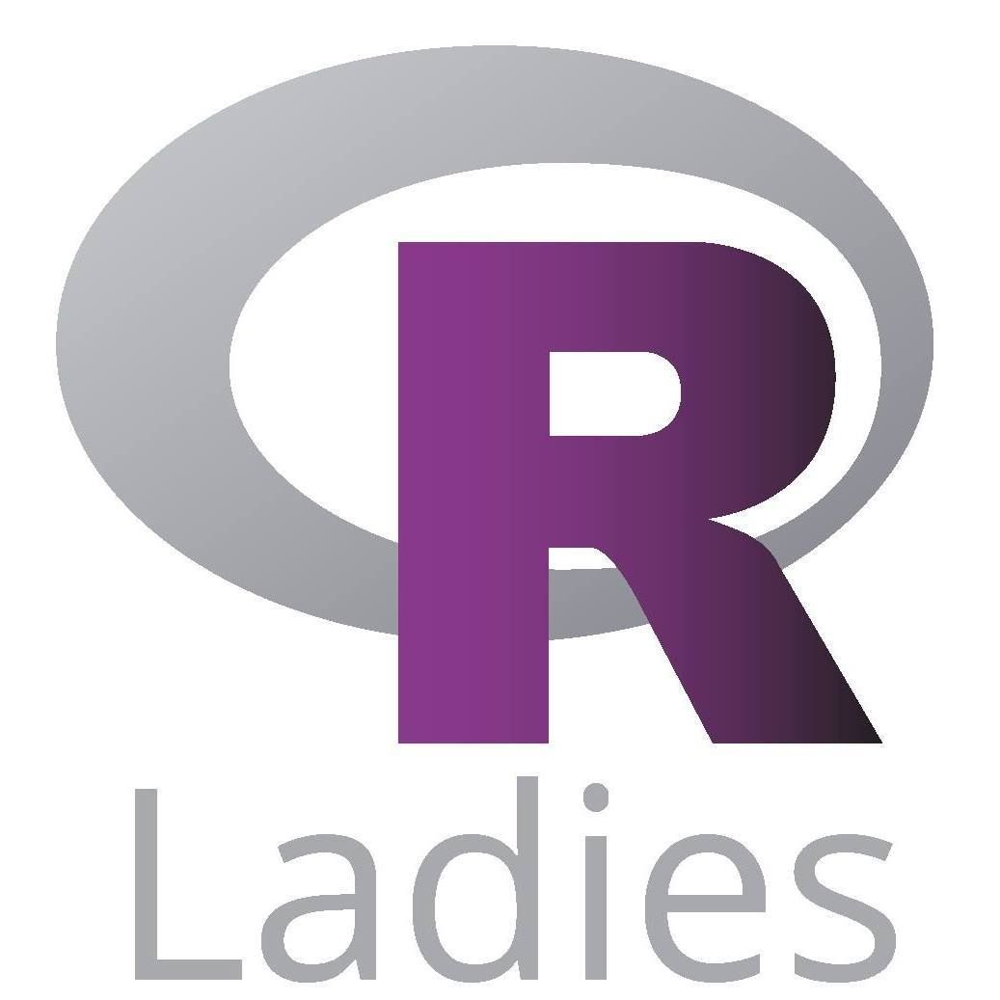

```{r setup, include=FALSE}
knitr::opts_chunk$set(eval = FALSE, collapse = TRUE, comment = NA, tidy = FALSE)
```

<div style="text-align: justify">


<div style="text-align: justify">

> Hace unos años ni se conocía el término de Ciencia de Datos, ¿Cómo estamos ahora? Con el Open Data Day se logró concientizar sobre la realidad de la Ciencia de Datos en el país, lo delicado que es el tratamiento de los mismos y además el impacto que puede tener en la sociedad de nuestro país, promoviendo transparencia y desarrollo. ¿Cuánto tardaremos en estar todos en una misma sintonía? Convivir con la Data.


El pasado sábado 7 de marzo, en el Centro Nacional de la Cultura (CENAC), se llevó a cabo el [Open Data Day](https://gobiernoabierto.go.cr/odd2020/) el cual fue iniciativa del poder ejecutivo de [Gobierno Abierto](https://gobiernoabierto.go.cr/). Era un espacio abierto a todos aquellos que estuvieran interesados del mundo de la Ciencia de Datos aquí en nuestro país. El evento se fundamentó en cuatro temáticas: datos ambientales, fiscalización de flujos de dinero, mapeo abierto y desarrollo equitativo. Miembros del grupo DABIA asistimos a algunas actividades y queremos compartir lo que vivimos. Si quiere tener un panorama de las actividades que se llevaron a cabo puede ver el siguiente [enlace](https://gobiernoabierto.go.cr/wp-content/uploads/2020/02/agenda_odd2020-1536x1189.jpg).

## Estándar de datos de Contrataciones Abiertas

El evento inició con la charla a cargo de **Camila Salazar Mayorga** que estudió comunicación y economía en la Universidad de Costa Rica, además de una maestría en Ciencia de Datos de la Escuela de Economía y Ciencias Políticas de Londres, actualmente labora en [Open Contracting Partnership](https://www.open-contracting.org/es/)


<div/>

<center>

> "Nuestro mundo está construido sobre contratos públicos. Nos aseguramos de que sean abiertos, justos y eficientes".

</center>

<div style="text-align: justify">

El objetivo de la charla era mostrar cuál es todo el procedimiento que se tiene que llevar a cabo antes de realizar la implementación de un contrato público, ya que como Camila mencionó: “Nuestro país y el mundo está construido sobre contratos públicos, por lo que es pertinente asegurarse que estos sean abiertos, justos y eficientes”. 
Camila nos explicó como por medio de un “Open Contracting Data Standard”, es posible dar seguimiento (“tracking”) los procesos de contratación, ya que este estándar corresponde a un archivo de formato JSON, el cual permite llevar un control de las 5 etapas que corresponden de un proceso de contratación:

* Planeación
* Licitación
* Adjudicación
* Contrato
* Implementación

Todo esto para conseguir que la contratación pública sea justa y efectiva, de manera que se brinde a todos, en todas partes, obras y servicios públicos que los ciudadanos necesitan. Por lo tanto, Camila nos enseñó que sí se puede aspirar a publicar, usar y mejorar los datos abiertos, brindar una posibilidad de supervisión y claridad de los objetivos y finalmente una trazabilidad del proceso que permitiría evitar fraudes.


<div/>

<center>

> Como empezar a implementar reformas de contratación abierta.

</center>

<div style="text-align: justify">

## Blockchain para registro de datos

Por otra parte, **Xavier Fernández** (cofundador y senior developer de EOS Costa Rica) nos compartió como **Blockchain** corresponde a una tecnología que se puede aplicar en diversas áreas e inclusive en el sistema estatal de nuestro país, ya que podría servir como una herramienta que ayuda ante la crisis de confianza del ciudadano en frente de sus instituciones.

Una charla de gran contenido, muy técnico, pero en palabras simples el Blockchain es una inmensa base de datos que se distribuye entre varios participantes. Corresponde a un libro de registro que contiene la historia completa de todas las transacciones que se han ejecutado en esa red. Hay que dejar claro que cada participante de la red se le denomina nodo. Este es un ordenador potente en el que almacena la información del Blockchain.

Por otro lado, tal y como lo detalló Xavier, se conoce como token al mensaje que transmiten los nodos, es una representación de la información que aloja la red y pueden ser servicios o bienes. Este token viaja encriptado por la red para que viaje sin miedo a comprometer su contenido. Estas transferencias de tokens se agrupan en bloques periódicamente y las transferencias nuevas que no caben en un bloque se agrupan en el posterior, el cual siempre está enlazado al anterior por eso se llama Blockchain o cadena de bloques.


<div/>

<center>

> ¿Cómo viaja la información a través de Blockchain?

</center>

<div style="text-align: justify">

## RLadies San José, Costa Rica

Tuvimos una grata experiencia con el grupo de estudiantes de estadística de la Universidad de Costa Rica que conforman **RLadies San José, Costa Rica**. Donde nos detallaron que su grupo surge de la comunidad global de RLadies que se fundó en 2012 en los Estados Unidos. Esta representación nacional nació en 2016 y entre sus actividades destacan reuniones y talleres en donde enseñan a otros estudiantes o personas de la comunidad académica civil a usar R como una poderosa herramienta para visualizar y analizar datos.

<div/>

<center>

{width=300px}

</center>

<div style="text-align: justify">

Asimismo destacan que ofrecen ayuda en la universidad, para que las personas puedan llegar y solicitar ayuda con la manipulación e interpretación de datos, independientemente de la disciplina; ya que, corresponden a un grupo abierto a retos y aprendizaje. Entre los temas tratados en este 2020 se pueden destacar: visualización de datos, uso de librería en R y el tidyverse. Para más información puede ingresar a su red social de [Twitter](https://twitter.com/rladiescr) e inclusive puede ayudarlas siguiendo el grupo y estando al tanto de su contenido, ya que corresponde a una gran iniciativa.

## Estandarización de datos abiertos sobre femicidios

**Hassel Fallas** nos compartió cómo  en los países de Latinoamérica se llevan estadísticas sobre la muerte violenta de las mujeres debido a su género; sin embargo, no se está midiendo lo mismo, lo que provoca que la comparación de las métricas sea imposible entre naciones. Es aquí donde nos explica como mediante el **ILDA** (Iniciativa Latinoamericana por los Datos Abiertos) y el **BID** (Banco Interamericano de Desarrollo) impulsan el proyecto de estandarización de datos para protocolizar procesos de identificación de femicidios para su posterior registro.

Hassel explica que de acuerdo con los femicidios registrados se tomarán en cuenta 4 indicadores para poder realizar la clasificación correspondiente. Los indicadores corresponden a:

* Relación previa
* Violencia sexual
* Ensañamiento en la violencia
* Denuncias previstas

Dependiendo de los resultados de dichos indicadores, se pretende conseguir uno de tres resultados: femicidio, no femicidio o desconocido. 

## Introducción a la Inteligencia Artificial y Aprendizaje Máquina en la nube

Finalmente se asistió a la presentación del Ingeniero en Software y Microsoft MVP **Esteban Solano**, acerca de la utilidad y potencial del machine learning y la inteligencia artificial a través de la nube, lo que permite el desarrollo de proyectos grandes y que consumen muchos recursos, pero que dichos recursos se encuentran en la nube, por lo tanto ya no es necesario contar con macro computadores para grandes modelos, es cuestión de saber que herramienta utilizar. 

Realizó una demostración de un sitio web el cual utilizaba estos conceptos y era capaz de reconocer texto en imágenes, con cualquier imagen que se compartiera. Esto gracias a los conceptos de inteligencia artificial que  está directamente ligado a machine learning, ya  que se basa en entrenar un modelo matemático con gran cantidad de datos para que cada vez la capacidad predictiva del mismo sea mejor.

Finalmente dio una pequeña muestra de **Microsoft Azure**, la herramienta en la nube que permite el desarrollo de modelos de machine learning y tareas relacionadas a la ciencia de datos que permitan generar un análisis predictivo para la toma de decisiones.

<div/>

<center>


</center>

<div style="text-align: justify">

## Tenía que llegar el final

Hubo más actividades a las cuáles el grupo DABIA no tuvo la fortuna de asistir, pero como todas las que se presenciaron, estamos seguros que fueron de máximo provecho. Este evento no dejó más que usuarios satisfechos, empoderados, inspirados y con ganas de seguir aprendiendo en este mundo tan versátil, amplio en posibilidades e incluso tan generoso que puede llegar a ser con la sociedad . Open Data Day 2020 consiguió generar un impacto y alzar la voz que la comunidad de Datos está presente en Costa Rica.

