```{r setup, include=FALSE}
knitr::opts_chunk$set(eval = FALSE, collapse = TRUE, comment = NA, tidy = FALSE)
```

<div style="text-align: justify">


<div style="text-align: justify">

> 
"El que ve el pasado sin sorpresas seguramente tendrá un futuro lleno de sorpresas". 
                                                            ― Amos Tversky


Generalmente los modelos de series de tiempo representan un solo tipo de patrón estacional, sea anual, mensual, trimestral, etc. La realidad es que en la mayoría de los casos las series de tiempo muestran múltiples patrones estacionales, los cuales suelen presentar patrones más complicados y variados.

 Pero, ¿a qué nos referimos con **estacionalidad compleja**? 
Es cuando la frecuencia es mayor a 12, es decir, cuando se utiliza una unidad de tiempo menor a un mes. Por ejemplo, una serie de tiempo por hora puede presentar un patrón estacional semanal, anual e incluso diaria. Estos casos pueden darse en los ingresos de un centro de salud, flujo de tráfico vehicular, consumo eléctrico, llamadas telefónicas, entre otras. 

Habitualmente muchos autores se restringen a modelos homocedásticos para no enfrentarse con problemas de los modelos no lineales y optan por realizar transformaciones como la de Box-Cox. 
Sin embargo, para nuestro alivio, existen modelos que extienden su modelo incluyendo parámetros, para que sean capaces de soportar y captar la estacionalidad de los datos.  Por lo que **la respuesta a nuestra pregunta es NO**, la estacionalidad compleja no debe ser un obstáculo para predecir con series de tiempo. 


###MODELOS PREDICTIVOS

<div style="text-align: justify"> 

Se presentan tres modelos predictivos que lidian con series de tiempo con estacionalidad compleja: SNAIVE, SARIMA y TBATS.

##SNAIVE

<div style="text-align: justify">

El método ingenuo es uno de los métodos básicos de predicción. Es muy simple de aplicar y muy efectivo. Los pronósticos Ingenuo (NaÏve) simplemente se definen como el valor de la última observación.  Se representa de la siguiente manera: 

<div/>

<center>
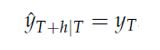


<div style="text-align: justify">
Donde, el término de la izquierda es la predicción y la derecha el valor de la última observación.

Este método es ruidoso, dado que no filtra ningún tipo de ruido, lo que hace que el modelo sea muy volátil a las predicciones. Puede que este no sea nuestro mayor interés, dado que típicamente el último período es utilizado para la predicción y eso es una gran suposición y no es muy realista. 
A pesar de ello, el método ingenuo es muy útil para considerarlo como punto de referencia para modelos más complejos.  Una extensión del modelo es el **método ingenuo estacional(SNAIVE)**. 

Formalmente, el pronóstico para el tiempo T+h para el modelo estacional ingenuo se escribe como sigue: 

<div/>

<center>

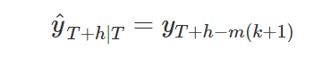

<div/>

<center>

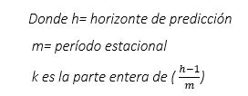
<div style="text-align: justify">
Este método es útil para datos altamente estacionales. Para estos casos los pronósticos son iguales al último valor de la misma temporada, esta estacionalidad se considera en el término agregado y permite detectar y manejar una serie de tiempo que tenga variaciones o patrones sistemáticos cada cierto período. 

<div style="text-align: justify">
##SARIMA

<div style="text-align: justify">

Un segundo modelo conocido por muchos es el ARIMA, los cuales se constituyen por dos partes: AR y MA. 
AR se basa en la idea de que el valor actual de la serie Xt  puede explicarse en función de valores p pasados, los cuales determinan el número de rezagos(lags, en inglés).
MA, por otro lado, se basa en un modelo “determinados por una fuente externa”, es decir, modela aquello que los retardos no capturaron en el modelo de AR.
La I (de “Integrado”) indica que los valores de los datos han sido reemplazados por la diferencia entre sus valores y los valores anteriores. Este proceso puede realizarse más de una vez con el fin de que el modelo se ajuste lo mejor posible.  

Su expresión algebraica es: 


<div/>

<center>

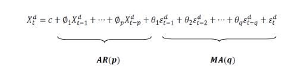


<div/>

<center>


<div style="text-align: justify">
El modelo ARIMA se compone de las dos partes mencionadas anteriormente y se representa de la siguiente manera: 

<div/>

<center>

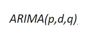
<div style="text-align: justify">
La extensión del modelo ARIMA cuando hay presencia de estacionalidad compleja y que deben ser captadas en los llamados Factores Estacionales, dentro de la estructura del modelo a construirse se encuentra en el modelo **SARIMA**.El cual se representa de la siguiente manera:

<div/>

<center>

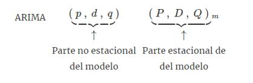
<div style="text-align: justify">
ARIMA contiene un componente que modela la dependencia regular asociada a observaciones consecutivas. Sin embargo, SARIMA muestra otro componente, que modela la dependencia estacional que está asociada a observaciones separadas por períodos.  

Del cual su expresión algebraica es:
<div/>

<center>

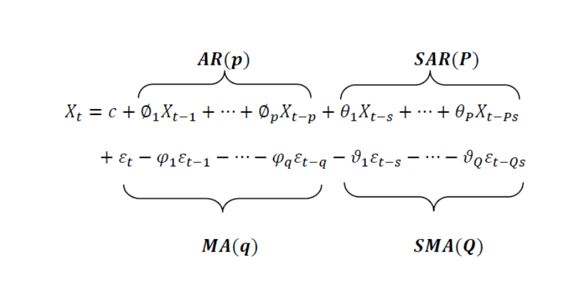
<div style="text-align: justify">

Lo que se añade al modelo son los parámetros que corresponde con la parte autorregresiva estacional (SAR) y la parte de media móvil estacional (SMA). 

<div style="text-align: justify">
>"Un hombre inteligente cree solo la mitad de lo que escucha, un hombre sabio sabe qué mitad."-Evan Esar

<div style="text-align: justify">
##TBATS

El modelo inicial proviene de modelos que se los denomina BATS, como un anacronismo de las características claves del modelo: transformación Box y Cox, errores ARMA, componentes de tendencia y estacionalidad. Estas pueden representarse de la siguiente manera: 

<div/>

<center>

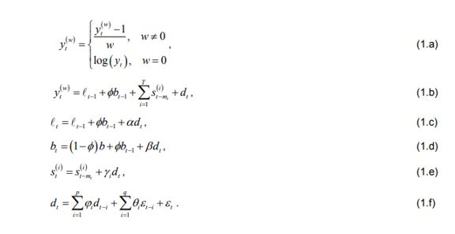

<div/>

<center>

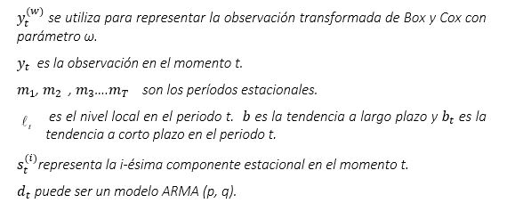
Además, 
<div/>

<center>

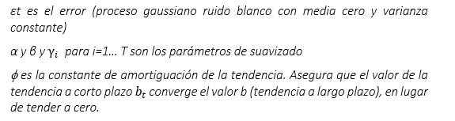
<div style="text-align: justify">

El modelo BATS es la generalización más obvia de los [modelos de innovación estacionales](https://www.fcecon.unr.edu.ar/web-nueva/sites/default/files/u16/Decimocuartas/blacona_andreozzi_magnano_caracteristicas_de_los_modelos_de_espacio.pdf) tradicionales.

Para conseguir un enfoque más flexible y parsimonioso es el modelo BATS + expresión  trigonométrica de los componentes estacionales.

A esta clase de modelos se lo llama TBATS, la T inicial se refiere a la transformación trigonométrica. **TBATS** (Trigonometric Exponential Smoothing State Space model with Box-Cox transformation, ARMA errors, Trend and Seasonal Components, con sus siglas en inglés)


<div/>

<center>


<div/>

<center>

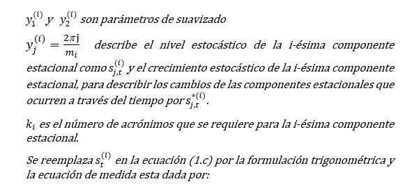
<div/>

<center>

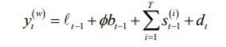

<div style="text-align: justify">
La función trigonométrica se puede utilizar para modelos con frecuencia estacional no entera, (por ejemplo, el caso de los días de un año como 365,25 para contemplar los años bisiestos).

El modelo TBATS presenta algunas ventajas como: 

*	Admite un espacio de parámetros grande con posibilidad de mejores pronósticos 

*	Permite múltiples componentes estacionales anidadas y no anidadas 

*	Trata características no lineales que a menudo se presentan en series de tiempo reales e involucra un método de estimación más simple y eficiente


La capacidad de los ajustes en los modelos de pronósticos para series de tiempo con estacionalidad compleja es maravillosamente útiles y aplicables para realizar un análisis atinado de series de tiempo. 
<div/>

<center>

##¡Es **tiempo de trabajar** y 
##            **descubrir el poder** de los modelos expuestos!


<div/>

<center>

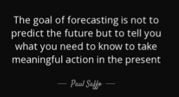

<div style="text-align: justify">
##Referencias
<div style="text-align: justify">
Blaconá, M. T., & Andreozzi, L.(2013). [MODELOS PARA SERIES DE TIEMPO CON ESTACIONALIDAD COMPLEJA ](https://www.fcecon.unr.edu.ar/web-nueva/sites/default/files/u16/Decimocuartas/blacona_andreozzi_modelos_para_series_de_tiempo.pdf).

Hyndam, R., & Athanasopoulos, G. (2018). [Forecasting:Principles and Practices ](https://otexts.com/fpp2/).


