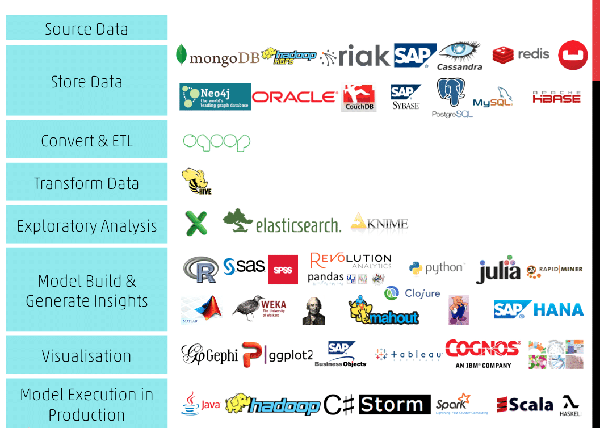

```{r setup, include=FALSE}
knitr::opts_chunk$set(eval = FALSE, collapse = TRUE, comment = NA, tidy = FALSE)
```

<center>


</center>

<div style="text-align: justify">

> ¿Ha tenido esa sensación de que programar no es lo suyo? Muchas personas podrían identificarse con la imagen de un muchacho frustrado frente a una computadora, quizá intentando desarrollar -sin éxito- algún pequeño software o trabajo relacionado con Ciencias de la Computación, pensando "esto de programar es para genios, no es para mí". Sin embargo, tal parece que los trabajos del futuro tendrán mucho que ver con esta ciencia, ¡alguien tiene que procesar los millones de datos que producimos desde nuestros celulares! ¿Qué hacer entonces? ¿Echarse a morir pensando que "programar" no es lo de uno? Para Luis, científico de datos de 22 años, no se trata de capacidades: quizá solo se debe abandonar el miedo un poco e intentarlo... puede que haya sorpresas. 

El pasado **jueves 7 de mayo**, el Capítulo Estudiantil de Circuitos y Sistemas **(CAS)**. del Tecnológico de Costa Rica. organizó la charla virtual *Utilidad del Big Data, ¡quitémosle el miedo!*, a cargo del universitario **Luis Sandí**, estudiante de Ing. Producción Industrial de último año de carrera. Sandí es miembro de Grupo DABIA, posee certificaciones en Ciencia de Datos y a trabajado en varios proyectos al respecto; pero, según dice, **su única ventaja en el mundo de los datos es que inició antes y ya le perdió el miedo**. Conceptos como *Big Data* impresionan a cualquiera; no obstante, veamos lo que Sandí tiene para contarnos. **¡Cero poses y tranquilidad!: empecemos por lo básico.**

## ¿Qué es Big Data?
Para Sandí, **Big Data es tener un montón de datos y que las herramientas clásicas no te sirvan para procesarlos**. ¿Cuánto es *un montón de datos*? Corresponde a **terabytes** y hasta **petabytes** (1 000 000 000 000 000 de bytes). ¿Nada poco verdad? ¿Y qué pasa con las herramientas? Bueno, ni la estadística clásica ni los softwares convencionales pueden tratar con semejante volumen de datos ¿Te imaginas un archivo de Excel con tantas filas que no se pueda ni abrir?

El Big Data es materia prima que, según Sandí, solo puede ser procesada mediante herramientas más potentes: **los lenguajes de programación**, así como **conocimientos estadísticos avanzados**. Aquí es donde varias áreas del conocimiento se cruzan para producir una nueva, que es la **Ciencia de Datos**: *En el momento en el que los datos se encuentran con la programación, el límite es el cielo*, afirma Sandí.

## ¿En qué consiste la Ciencia de Datos?

<div/>

<center>


</center>

<div style="text-align: justify">

**Ciencia de Datos es el producto de combinar las Ciencias de la Computación y TI, conocimientos matemático-estadísticos y conocimiento o dominio del negocio**; con experiencia en estas tres áreas, se tiene lo necesario para enfrentarse al Big Data. Este es el punto  en el que muchos claudican, **lanzarse a dominar estas tres áreas puede parecer abrumador**. Sin embargo, ¿acaso estas áreas del saber no se enseñan en universidades como el Tecnológico? ¿Acaso los profesionales de este país no tienen capacidad y formación en estas materias?

<div/>

<center>

> "Yo estudio Ing. en Producción Industrial, por lo que he llevado muchos cursos de matemática, hasta 4 o más cursos de estadística y me han formado para trabajar en el mundo empresarial; pero tenía una gran debilidad, que eran los conocimientos en computación. ¡Tenía que capacitarme!".

</center>

<div style="text-align: justify">

Parafraseando a Sandí, *los Científicos de Datos no son genios, solo son personas con conocimientos específicos y que siguen un proceso de análisis específico*. ¿Cuál es este proceso? Según Sandí, se resume en los siguientes pasos:

### El ciclo de vida de un proyecto de Ciencia de datos

1. Entender el negocio 
2. Encontrar los datos y estudiar su utilidad (Data Mining)
3. Limpiar los datos (Data Cleaning) 
4. Explorar los datos 
5. Ingenieria de variables (Feature Engineering): qué informacion quiero 
6. Modelar los datos (opcional) 
7. Visualizar los datos

## ¿Por qué debería ser un Científico de Datos?
Durante la charla, Sandí arrojó información muy potente para interesarse por la Ciencia de Datos y la utilidad al Big Data (indistintamente de la carrera de cada uno). En este blog, se resumirá en tres grandes razones.

### 1. Desequilibrio en la oferta/demanda de profesionales
Afirma Sandí que el *boom* de la Ciencia de Datos ocurrió aproximadamente en 2015, en Estados Unidos, y de ahí en adelante **la demanda por especialistas en este tema no ha parado de crecer como la espuma**, como se observa en el siguiente gráfico. 

<div/>

<center>


</center>

<div style="text-align: justify">

Y, como si fuera poco, según una [investigación global](https://www.ibm.com/downloads/cas/3RL3VXGA), promovida de IBM, el presente año la demanda por científicos de datos aumentará un llamativo 28%. En términos simples: hay mucha demanda y poca oferta, lo que a su vez tiene un efecto predecible. 
Si se consultan páginas como **[glassdoor.com](https://www.glassdoor.com/Job/jobs.htm?typedKeyword=data%20scientist&sc.keyword=data%20scientist&locT=C&locId=2212806) se encontrará que el salario de un científico de datos en Costa Rica puede rondar entre los 80 mil dólares a 100 mil dólares al año** (eso es, francamente, bastante dinero); además, [según esta misma fuente](https://www.glassdoor.com/Salaries/data-scientist-salary-SRCH_KO0,14.htm), en promedio y en Estados Unidos, el salario de esta profesión ronda los 113 mil dólares al año... **¡casi casi 10 mil dólares al mes!**

### 2. El trabajo del futuro: una ventaja competitiva
En palabras de Sandí y la [Harvard Bussines Review](https://hbr.org/2012/10/data-scientist-the-sexiest-job-of-the-21st-century), *la Ciencia de Datos es el trabajo más sexy del siglo XXI*, esto ya que **dicha área del conocimiento es uno de los componentes fundamentales de la 4° Revolución Industrial**, fenómeno que, a su vez, es responsable de la automatización -y por ende, destrucción- de un sin fin de trabajos y tareas convencionales.

El razonamiento parece simple: **capacitarse en Ciencia de Datos es estar del lado ganador de esta revolución**; no obstante, esto va aún más allá: para el [Foro Económico Mundial](https://www.weforum.org/reports/data-science-in-the-new-economy-a-new-race-for-talent-in-the-fourth-industrial-revolution) tener conocimientos en esta ciencia es tener **la habilidad más competente en tiempos de la Industria 4.0**, una ventaja competitiva valiosísima para cualquier profesional.

### 3. Utilidad del Big Data... para cualquier área y propósito 
Ni la Ciencia de Datos es solo una herramienta para las empresas y ni el Big Data es útil solo para ganar dinero. **La realidad es que un científico de datos puede trabajar en cualquier área que usted se pueda imaginar**, muchas de ellas enfocadas a objetivos nobles: desde periodismo, pasando por medicina y hasta ciencias climáticas. La versatilidad de esta ciencia nos regresa a la definición de Sandí, que el Big Data es solo tener muchos datos y aplicar herramientas específicas para procesarlos... las razones para hacerlo las escogemos nosotros. Le dejamos el siguiente enlace como evidencia de lo anterior: **[¿Qué tal aprovechar el Big Data para hacer del mundo un lugar mejor?](https://insidebigdata.com/2020/04/14/data-science-is-changing-the-world-for-the-better-heres-how/)**

## ¿Por dónde empiezo?

<div/>

<center>



</center>

<div style="text-align: justify">

La anterior imagen muestra cuan importante es el consejo que Sandí daba en la charla: *Es muy importante travesear, descargar un software, buscar tutoriales y simplemente probar, así empecé yo*. No importa con qué dar inicio, lo importante es empezar. Sandí comentaba, por ejemplo, que el lenguaje de programación **Python** está teniendo un auge muy grande y es un excelente punto de partida; no obstante, ¿cuál es su recomendación personal?: **Lenguaje de programación R y R-Studio**.

<div/>

<center>

> "Estas dos herramientas son totalmente gratuitas. R es el lenguaje y R-Studio es uno de los ambientes de desarrollo más populares, uno muy amigable; yo prácticamente solo trabajo en R-Studio. Una gran ventaja de R es su comunidad de desarrolladores, hay muchas personas a quienes les apasiona esto, dispuestos a ayudar."

</center>

<div style="text-align: justify">

Sandí mencionó también dos medios muy buenos para capacitarse en estas herramientas y en Ciencia de Datos en general:

* **DataCamp.com** : Plataforma de cursos en línea, tiene un costo
* **R Studio Education** : Sitio web con recursos para capacitarse, es gratuito

## Estamos para ayudar :3
Como dijo Sandí, la única ventaja de algunos es haber iniciado antes y eso ni siquiera es una excusa para acaparar el conocimiento sobre este tema: debido al desequilibrio en la oferta y demanda de profesionales y a la gran utilidad del Big Data, a nadie le conviene que la información quede reservada para algunos pocos. Siguiendo ese razonamiento, Sandí compartía que **los proyectos de Grupo DABIA -como el "Rastreador de COVID19 de Costa Rica"- son totalmente de código abierto**, disponibles a través del [repositorio del grupo en github.com](https://github.com/DabiaCenter). 

La idea detrás de charlas como esta es motivar a otras personas a considerar seriamente la Ciencia de Datos como una alternativa profesional, sabiendo que **muchas personas estamos dispuestas a apoyar en esos primeros pasos hacia el mundo de los datos**.

<div/>

<center>

> "Me enorgullece mucho que más de 70 personas hayan decidido asistir a esta charla. ¡No le tengan miedo a estos temas! Más allá de todo, yo solo soy un estudiante de 22 años. Lo importante es lanzarse al agua y, recuerden, estamos para ayudar."

</center>

<div style="text-align: justify">
